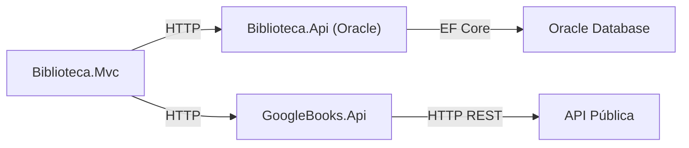

# 📚 Biblioteca Digital Inteligente

## **Descrição do Projeto**
Sistema de biblioteca online baseado em **arquitetura de microsserviços**, composto por:

- **Biblioteca.Api (WebAPI 1)** → CRUD de livros, autores e empréstimos usando Oracle + EF Core.  
- **GoogleBooks.Api (WebAPI 2)** → Consome a Google Books API para obter informações adicionais de livros.  
- **Biblioteca.Mvc (MVC)** → Interface web para consultar livros, autores e cadastrar empréstimos.  
- **Libraries**:
  - `Domain` → Entidades do sistema (`Book`, `Author`, `Loan`).  
  - `Application` → Regras de negócio, serviços e interfaces.  
  - `Infrastructure` → DbContext e Migrations.

---

## **Pré-requisitos**

- .NET 7 SDK ou superior
- Oracle Database XE (ou Oracle compatível)
- Visual Studio 2022 / VS Code
- Postman (opcional, para testar APIs)

---

## **Executando os Projetos**

### **1. Rodar Biblioteca.Api**
```bash
cd Biblioteca.Api
dotnet run
```
- URL: `http://localhost:5000`  
- Swagger: `http://localhost:5000/swagger`

### **2. Rodar GoogleBooks.Api**
```bash
cd GoogleBooks.Api
dotnet run
```
- URL: `http://localhost:5003`  
- Swagger: `http://localhost:5003/swagger`

### **3. Rodar Biblioteca.Mvc**
```bash
cd Biblioteca.Mvc
dotnet run
```
- URL: `http://localhost:5002`

---

## **Migrations (Infrastructure)**

```bash
cd Biblioteca.Infrastructure
dotnet ef migrations add InitialCreate -p Biblioteca.Infrastructure -s Biblioteca.Api -o Migrations
dotnet ef database update -p Biblioteca.Infrastructure -s Biblioteca.Api
```

- `-p` ou `--project`: projeto onde estão as Migrations (`Infrastructure`)  
- `-s` ou `--startup-project`: projeto que configura o DbContext (`Biblioteca.Api`)  

---

## **Endpoints Principais**

### **Biblioteca.Api (Porta 5000)**

| Método | Endpoint              | Descrição                         |
|--------|----------------------|----------------------------------|
| GET    | `/api/books`         | Lista todos os livros             |
| POST   | `/api/books`         | Cadastrar novo livro              |
| GET    | `/api/authors`       | Lista todos os autores            |
| POST   | `/api/authors`       | Cadastrar novo autor              |
| GET    | `/api/loans`         | Lista todos os empréstimos        |
| POST   | `/api/loans`         | Registrar novo empréstimo         |

#### **Exemplos de POST**

- **Cadastrar Autor**
```http
POST http://localhost:5000/api/authors
Content-Type: application/json

{
  "name": "J.K. Rowling"
}
```

- **Cadastrar Livro**
```http
POST http://localhost:5000/api/books
Content-Type: application/json

{
  "title": "Harry Potter and the Sorcerer's Stone",
  "isbn": "9780747532699",
  "authorId": 1
}
```

- **Registrar Empréstimo**
```http
POST http://localhost:5000/api/loans
Content-Type: application/json

{
  "bookId": 1,
  "borrower": "Henzo Puchetti",
  "loanDate": "2025-08-20T23:00:00"
}
```

---

### **GoogleBooks.Api (Porta 5003)**

| Método | Endpoint                    | Descrição                                |
|--------|----------------------------|-----------------------------------------|
| GET    | `/api/googlebooks/{isbn}`  | Busca metadados de livro pelo ISBN       |

---

### **MVC (Porta 5002)**

| Rota           | Descrição                                      |
|----------------|-----------------------------------------------|
| `/Authors`     | Lista autores (consome Biblioteca.Api)       |
| `/Books`       | Lista livros (consome Biblioteca.Api)       |
| `/Loans/Create`| Formulário para registrar empréstimos        |

---

## **Testando com Postman**

1. **Biblioteca.Api**:  
   - `GET http://localhost:5000/api/books`  
   - `GET http://localhost:5000/api/authors`  
   - `POST http://localhost:5000/api/authors` → JSON exemplo acima  
   - `POST http://localhost:5000/api/books` → JSON exemplo acima  
   - `POST http://localhost:5000/api/loans` → JSON exemplo acima  

2. **GoogleBooks.Api**:  
   - `GET http://localhost:5003/api/googlebooks/9780140328721`  

3. **MVC**:  
   - `GET http://localhost:5002/Books`  
   - `GET http://localhost:5002/Authors`  

> Obs.: MVC retorna JSON por enquanto. Futuramente pode renderizar views Razor.

---

## **Aplicação de SOLID**

| Princípio | Como foi aplicado |
|------------|-----------------|
| **SRP** (Single Responsibility) | Cada classe tem responsabilidade única: `Book`, `Author`, `Loan` no Domain; controllers apenas manipulam requisições. |
| **OCP** (Open/Closed) | GoogleBooksProvider pode ser estendido para outras APIs sem alterar código existente. |
| **DIP** (Dependency Inversion) | Controllers dependem de abstrações (`IHttpClientFactory`, serviços) e não de implementações concretas. |

---

## **Clean Code**

- Nomes claros (`BooksController`, `AuthorsController`, `BibliotecaDbContext`)  
- Baixo acoplamento entre MVC, APIs e infraestrutura  
- Classes coesas e funções pequenas  

---

## **System Design**



- MVC consome **Biblioteca.Api** e **GoogleBooks.Api**  
- **Biblioteca.Api** conecta-se ao **Oracle** para gerenciar estoque de livros  
- **GoogleBooks.Api** busca dados externos e devolve JSON
